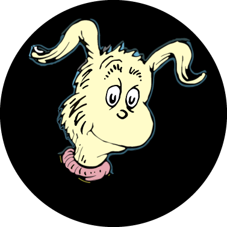

# Knox

## Introduction
Knox (READ: "NO X") is a Discord bot that automatically deletes messages containing Twitter/X links in any channel on servers where it is added.

## Configuration/Setup

1. Create a Discord bot and get a token: https://discord.com/developers/applications
2. Set the `DISCORD_TOKEN` environment variable in the `docker-compose.yml` file.
3. Set the `LOG_LEVEL` environment variable in the `docker-compose.yml` file.
4. Run `docker compose up -d` to start the bot.

## Why?

Because Elon Musk is a fascist techbro fuckboi and should be de-platformed with extreme prejudice.

## What's Next?

* Support for blocking other problematic platforms (READ: Meta/Facebook/Instagram)
* Configurable whitelisting of channels
* Configurable whitelisting of users
* Configurable whitelisting of domains/platforms

## License

This project is licensed under the MIT License - see the [LICENSE](LICENSE.md) file for details.
